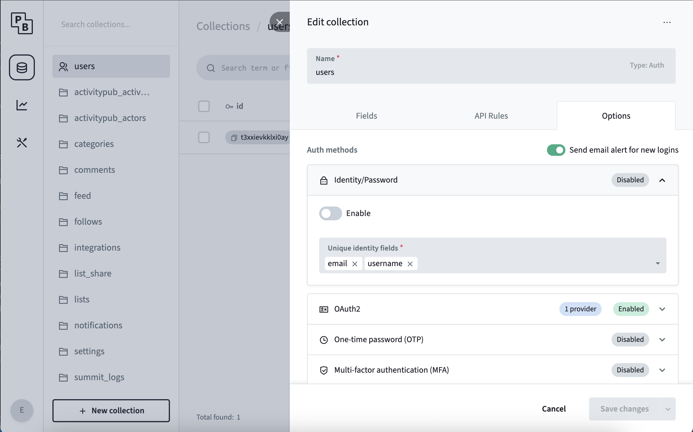

### Create an OAuth app

This step will vary wildly from provider to provider. Please refer to your provider's documentation for the specific steps.

No matter your provider, you will need a redirect URL. This redirect URL must have the following format: `$ORIGIN/login/redirect`. 
`$ORIGIN` refers to the `ORIGIN` environment variable that defines the public host at which your <span class="-tracking-[0.075em]">wanderer</span> instance can be reached. 
So for the default installation, the redirect URL is `http://localhost:3000/login/redirect`.

In any case, once you have successfully created your OAuth app you will receive a Client ID and a Client Secret.

### Enable a provider in PocketBase


In the PocketBase admin panel navigate to the `users` table. Click the gear icon at the top to open the table's settings and navigate to `Options`.
In the tab `OAuth2`, add your provider and fill in the Client ID and Client Secret from the step before and save your changes.

### Providers that reject the default scopes

<span class="-tracking-[0.075em]">wanderer</span> requests the scopes `openid`, `profile` and `email` from every OIDC provider. Some providers reject an authorization request that contains scopes they do not know, instead of ignoring them, and the login then fails before the consent screen appears.

For those providers set the scope list on the `db` service, using the variable for the slot the provider is configured in: `OIDC_SCOPES` for `oidc`, `OIDC2_SCOPES` for `oidc2` and `OIDC3_SCOPES` for `oidc3`. Slots without an override keep the default scopes, so other OIDC providers are not affected.

#### OpenStreetMap

OSM accepts neither `profile` nor `email`. `openid` is enough for login. If OSM is configured as `oidc`:

```yaml
services:
  db:
    environment:
      OIDC_SCOPES: "openid"
```

Accounts created through OSM may receive a generated username such as `users729068` when the OSM display name cannot be used as the `username`, for example because it contains characters the field does not allow or is already taken.

### Disable password authentication

After enabling the neccessary OAuth2 providers for your application you may want to disable the standard local password authentication.



In the PocketBase admin panel navigate to the `users` table.
Click the gear icon at the top to open the table's settings and navigate to `Options`.

In the tab `Identity/Password`, toggle the switch and save the configuration.
